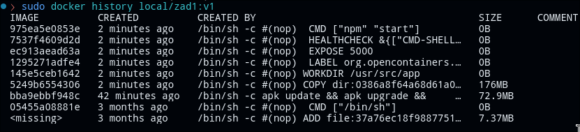
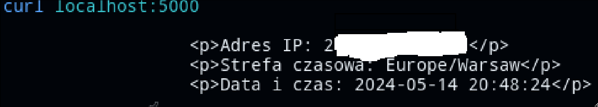

Realizacja części obowiązkowej

Plik server.js
```
const express = require("express");
const port = 5000;
const geoip = require("geoip-lite");
const moment = require("moment-timezone");
const http = require('http');


const app = express();

app.get("/", function (req, res) {
    http.get({'host': 'api.ipify.org', 'port': 80, 'path': '/'}, function(resp) { // Pinguje strone, która zwraca moje publiczne IP
        let ipAddr = '';

        resp.on('data', function(chunk) {
            ipAddr += chunk;
        });

        resp.on('end', function() {
            const geo = geoip.lookup(ipAddr);
            if (!geo) {
                return res.status(400).send("Nie udało się uzyskać danych lokalizacyjnych");
            } else {
                const clientTime = moment.tz(moment(), geo.timezone).format("YYYY-MM-DD HH:mm:ss");
                res.send(`
                    <p>Adres IP: ${ipAddr}</p>
                    <p>Strefa czasowa: ${geo.timezone}</p>
                    <p>Data i czas: ${clientTime}</p>
                `);
            }
        });
    });
});

app.listen(port, function () {
    console.log(`Server nasłuchuje na porcie ${port}!`);
    console.log("Autor: Norbert Kowalik")
});
```

Zawartość Dockerfile

```
FROM scratch as build


ADD alpine-minirootfs-3.19.1-x86_64.tar.gz /
RUN apk update && apk upgrade && \
    apk add --no-cache --update nodejs npm

WORKDIR /usr/src/app

COPY package*.json ./
COPY server.js ./

RUN npm install

FROM alpine:latest

RUN apk update && apk upgrade && \
    apk add --no-cache --update nodejs npm

COPY --from=build /usr/src/app /usr/src/app

WORKDIR /usr/src/app

LABEL org.opencontainers.image.authors="Norbert Kowalik"

EXPOSE 5000

HEALTHCHECK --interval=10s --timeout=1s \
  CMD curl -f http://localhost:5000 || exit 1

CMD ["npm", "start"]
```

Komenda budująca obraz
```
docker build -f Dockerfile -t local/zad1:v1 .
```

Sprawdzenie stworzonych warstw
```
docker history local/zad1:v1
```


Uruchomienie kontenera
```
docker run -d -p 5000:5000 --name zad1  local/zad1:v1 
```

Sprawdzenie działania


