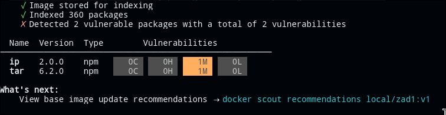
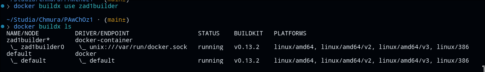
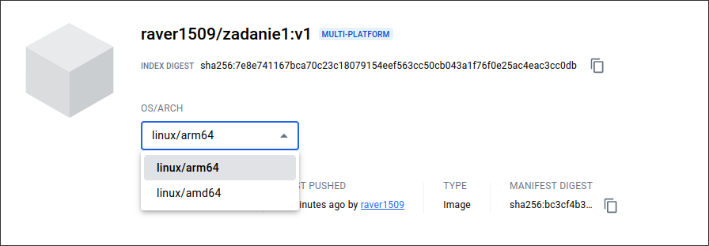

Wykazanie braku składowych z oceną CVSS w zakresie High lub Critical
```
docker scout cves --format only-packages --only-vuln-packages local/zad1:v1
```


Stworzenie odpowiednie buildera
```
docker buildx create --name zad1builder --driver docker-container --boot
```

Ustawienie naszego buildera jako domyslny


Nie możliwe było zbudowanie obrazu wieloplatformowego używając pliku bazowego alpine przeznaczonego na konkretną platformę więc w pliku stworzyłem Dockerfile2,
gdzie warstwą bazową jest alpine:latest

```
FROM alpine:latest as build

RUN apk update && apk upgrade && \
    apk add --no-cache --update nodejs npm

WORKDIR /usr/src/app

COPY package*.json ./
COPY server.js ./

RUN npm install

FROM alpine:latest

RUN apk update && apk upgrade && \
    apk add --no-cache --update nodejs npm

COPY --from=build /usr/src/app /usr/src/app

WORKDIR /usr/src/app

LABEL org.opencontainers.image.authors="Norbert Kowalik"

EXPOSE 5000

HEALTHCHECK --interval=10s --timeout=1s \
  CMD curl -f http://localhost:5000 || exit 1

CMD ["npm", "start"]
```

Zbudowanie obrazu z użyciem naszego buildera
```
docker buildx build -q -f Dockerfile -t docker.io/raver1509/zadanie1:v1 --platform linux/arm64,linux/amd64 --push .
```
Powstanie obrazu wieloplatformowego

